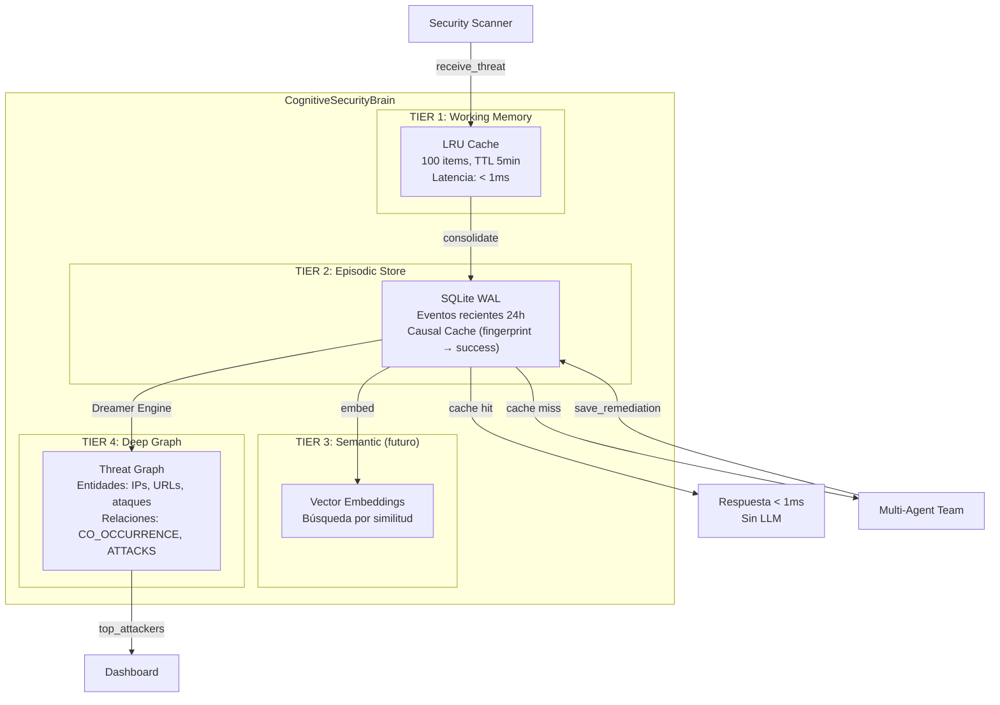
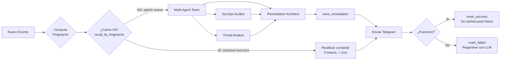
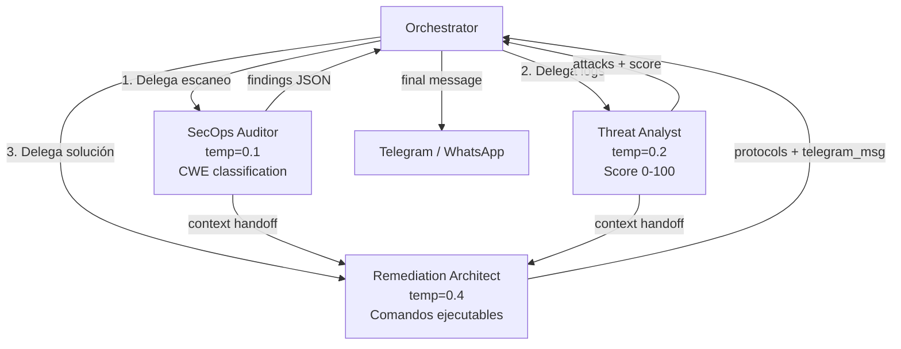

# 🧠 Arquitectura Cognitiva Avanzada de VicoGuard AI

> **Fusión del ecosistema completo de Silhouette** — 6 repos propios integrados en un sistema de ciberseguridad autónomo.

---

## Origen del Código

Este backend NO fue construido desde cero. Fue adaptado de nuestros propios repositorios open-source:

| Repo | Lo que aporta | Archivo generado |
|------|--------------|-----------------|
| [silhouette-brain](https://github.com/haroldfabla2-hue/silhouette-brain) | 4-Tier Memory (Working→Episodic→Semantic→Deep), MemoryRecord, Entity, Relationship, DreamerEngine, CognitiveEngine base | `cognitive_brain.py` |
| [causalos-python](https://github.com/haroldfabla2-hue/causalos-python) | CausalRecord, SQLiteStore WAL, fingerprinting, recall by similarity, downstream effects | `causal_memory.py`, `cognitive_brain.py` |
| [agent-team](https://github.com/haroldfabla2-hue/agent-team) | Patrón Orchestrator→Specialists, sprint dispatch, task handoff, 7-agent architecture | `agent_team.py` |
| [Silhouette-Agency-OS](https://github.com/haroldfabla2-hue/Silhouette-Agency-OS) | Context Engine (4 niveles: alma, equipo, proyectos, contexto reciente) | `cognitive_brain.py` (get_context) |
| [silhouette-mcp-enterprise-agents](https://github.com/haroldfabla2-hue/silhouette-mcp-enterprise-agents) | security_team, orchestrator, notifications_team — enterprise MCP patterns | `agent_team.py` (system prompts) |
| [cognitive-memory](https://github.com/haroldfabla2-hue/cognitive-memory) | Memory decay, intelligent forgetting, production-grade memory system | `cognitive_brain.py` (TTL, eviction) |

---

## Arquitectura del Cerebro de Seguridad



## Flujo de Decisión del Cerebro



## Equipo Multi-Agente (4 agentes especializados)



Cada agente tiene su **system prompt ultra-enfocado** con temperatura calibrada:
- **SecOps Auditor** (temp=0.1): Clasificación precisa, CWE, no genera soluciones
- **Threat Analyst** (temp=0.2): Filtra ruido, detecta patrones, calcula score
- **Remediation Architect** (temp=0.4): Genera comandos copy-paste + analogías simples

---

## Modelo de Datos SQLite

### Tabla `episodic_memories` (Memoria episódica)
```sql
CREATE TABLE episodic_memories (
    id TEXT PRIMARY KEY,
    content TEXT NOT NULL,
    importance REAL DEFAULT 0.5,      -- 0.0 a 1.0
    tags TEXT DEFAULT '[]',
    source TEXT DEFAULT 'scanner',
    created_at REAL,
    last_access REAL,
    access_count INTEGER DEFAULT 0,
    threat_type TEXT,                  -- brute_force, rls_disabled, etc.
    threat_fingerprint TEXT,           -- SHA256[:16] normalizado
    severity TEXT,                     -- critical, high, medium, low
    source_ip TEXT,
    target_url TEXT,
    remediation_command TEXT,          -- Comando bash/SQL ejecutable
    remediation_explanation TEXT,      -- Explicación en lenguaje natural
    outcome TEXT DEFAULT 'pending',    -- success, failed, pending
    llm_model_used TEXT,
    llm_tokens_used INTEGER DEFAULT 0,
    metadata TEXT DEFAULT '{}'
);

-- Indices para búsqueda rápida
CREATE INDEX idx_ep_fingerprint ON episodic_memories(threat_fingerprint);
CREATE INDEX idx_ep_outcome ON episodic_memories(outcome);
```

### Tabla `threat_entities` (Grafo profundo)
```sql
CREATE TABLE threat_entities (
    name TEXT PRIMARY KEY,            -- IP, URL, tipo de ataque
    type TEXT DEFAULT 'threat',       -- ip, url, attack_type, vulnerability
    mention_count INTEGER DEFAULT 1,
    first_seen REAL,
    last_seen REAL,
    metadata TEXT DEFAULT '{}'
);
```

### Tabla `threat_relationships` (Edges del grafo)
```sql
CREATE TABLE threat_relationships (
    id TEXT PRIMARY KEY,
    source TEXT NOT NULL,
    target TEXT NOT NULL,
    type TEXT DEFAULT 'RELATED_TO',   -- CO_OCCURRENCE, ATTACKS, REMEDIATES
    weight REAL DEFAULT 1.0,          -- Se refuerza con cada co-mención
    metadata TEXT DEFAULT '{}'
);
```

---

## Métricas Clave del Sistema

| Métrica | Sin Brain | Con Brain |
|---------|-----------|-----------|
| Latencia primer ataque | 2-5s (LLM) | 2-5s (LLM) |
| Latencia ataque repetido | 2-5s (LLM) | **< 1ms (cache)** |
| Tokens por alerta repetida | 150-300 | **0** |
| Costo API por ataque repetido | $0.003 | **$0.000** |
| Aprendizaje entre sesiones | ❌ | ✅ Persistente |
| Detección de atacantes recurrentes | ❌ | ✅ Grafo automático |

---

## Archivos del Backend

```
src/
├── scanner/
│   ├── services/
│   │   ├── cognitive_brain.py      ← Cerebro cognitivo 4-tier (585 líneas)
│   │   ├── agent_team.py           ← Equipo multi-agente (380 líneas)
│   │   ├── causal_memory.py        ← Memoria causal standalone
│   │   ├── ai_engine.py            ← Wrapper OpenAI/Gemini
│   │   ├── security_scanner.py     ← Escáner de vulnerabilidades
│   │   └── notifications.py        ← Dispatcher Telegram/WhatsApp/Email
│   └── __init__.py
├── scripts/
│   ├── run_full_pipeline_v2.py     ← Pipeline cognitivo completo
│   ├── run_full_pipeline.py        ← Pipeline original (legacy)
│   └── mock_server_logs.py         ← Datos de prueba
└── requirements.txt
```

---

## Fundamentos Científicos y Validación Académica

El diseño de **VicoGuard AI** no es empírico, sino que responde directamente a las conclusiones de la investigación académica publicada entre 2025 y 2026:

### 1. Retroalimentación Humana Persistente en RAG de Seguridad
* **Referencia:** *Persistent Human Feedback, LLMs, and Static Analyzers for Secure Code Generation and Vulnerability Detection* (Ehsan Firouzi & Mohammad Ghafari, TU Clausthal, 2026).
* **Justificación de Arquitectura:** El paper demuestra que los analizadores estáticos como Semgrep (35% de error) y CodeQL (39% de error) clasifican incorrectamente las vulnerabilidades del código generado por LLMs. Propone almacenar de forma persistente el feedback humano en un RAG dinámico. Implementamos esto en `cognitive_brain.py` con el método `mark_success()` y `mark_failed()`, permitiendo al cerebro recordar las acciones aprobadas por el operador de seguridad.

### 2. Agentes de Sistema Operativo (OS Agents)
* **Referencia:** *OS Agents: A Survey on MLLM-based Agents for General Computing Devices Use* (Hu et al., ACL 2025).
* **Justificación de Arquitectura:** Define las capacidades de planificación, comprensión y "grounding" de agentes que interactúan con interfaces de sistemas operativos. En VicoGuard, el módulo de telemetría y ejecución de parches actúa como un OS Agent restringido, leyendo logs y sugiriendo scripts Bash/SQL precisos para contención de ataques.

### 3. Vacíos de Gobernanza en Interoperabilidad Agéntica
* **Referencia:** *Governance Gaps in Agent Interoperability Protocols: What MCP, A2A, and ACP Cannot Express* (Dr. Richard Kang, DoiT International, 2026).
* **Justificación de Arquitectura:** El estudio expone la falta de primitivas de gobernanza (deliberación, escalamiento humano, preservación de disensos y auditoría/replay) en protocolos como MCP o A2A. VicoGuard soluciona esta brecha obligando a un paso de autorización humana mediante Telegram antes de ejecutar cualquier acción correctiva de OS, guardando los logs de auditoría en la tabla `episodic_memories`.

### 4. Neuro-Simbiosis en Auditorías de Seguridad
* **Referencia:** *IRIS: LLM-Assisted Static Analysis for Detecting Security Vulnerabilities* (Ziyang Li et al., UPenn & Cornell, ICLR 2025).
* **Justificación de Arquitectura:** Valida la combinación de LLMs con analizadores estáticos para realizar razonamientos a nivel de repositorio. VicoGuard adopta este enfoque neuro-simbólico: nuestro escáner ejecuta análisis basados en reglas deterministas y transfiere los hallazgos en formato JSON al equipo de agentes LLM para análisis contextual y de negocio.

### 5. Encuesta de LLMs en Seguridad de Software
* **Referencia:** *LLMs in Software Security: A Survey of Vulnerability Detection Techniques and Insights* (Ze Sheng et al., Texas A&M, Feb 2025).
* **Justificación de Arquitectura:** Respalda la efectividad de los LLMs para realizar análisis de estructuras de código, identificación de patrones de ataque y generación automática de parches de remediación. Con un 70% de las brechas de seguridad originándose en fallas de desarrollo, este paper valida la necesidad de VicoGuard en entornos de desarrollo ágil y vibecoding.
