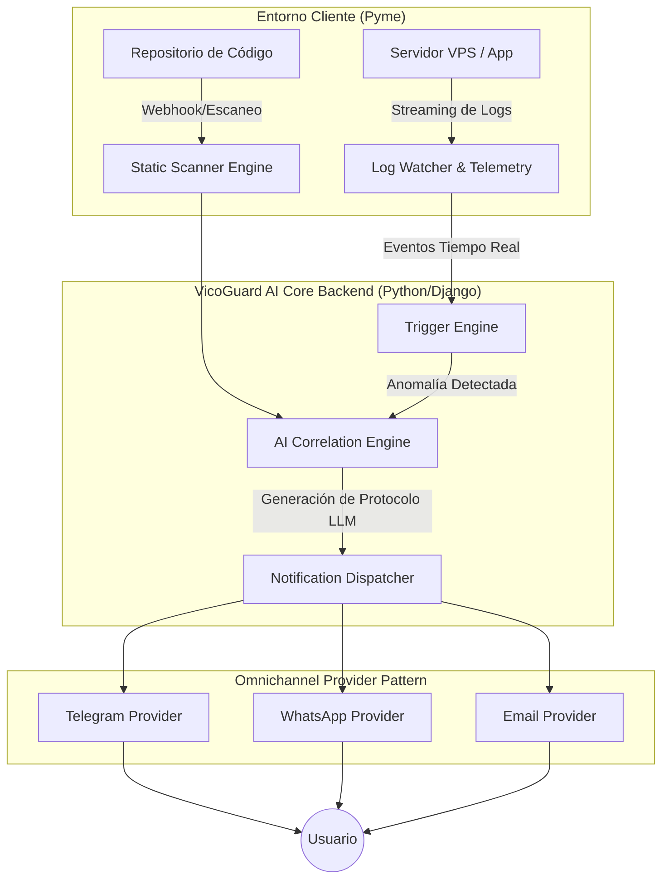

# 🏗️ Arquitectura Técnica Completa (Visión 360° & MVP Hackatón)

## 1. Topología y Flujo de Datos (Mermaid)



## 2. Modelo de Datos Detallado (SQLite)

El sistema utiliza un esquema relacional optimizado para la latencia del MVP:

| Tabla | Campos Principales | Relaciones / Propósito |
|---|---|---|
| `projects` | `id` (PK, UUID), `name` (Str), `repo_url` (Str), `supabase_url` (Str), `api_key` (Str) | Perfil de la Pyme y sus credenciales de monitoreo. |
| `scans` | `id` (PK, UUID), `project_id` (FK), `status` (Enum), `vulnerabilities_json` (JSON), `created_at` | Registro de auditorías de código estático (ej. RLS roto). |
| `telemetry_events` | `id` (PK, UUID), `project_id` (FK), `event_type` (Str), `severity` (Int), `payload` (JSON), `timestamp` | Almacena los logs críticos. Gran volumen, optimizado con índices por `timestamp`. |
| `notifications` | `id` (PK, UUID), `project_id` (FK), `provider` (Str), `message_body` (Text), `sent_at` | Historial de alertas enviadas para evitar *spam* al usuario. |

## 3. Contratos de API (REST endpoints)

### 3.1 Escaneo de Repositorio
* **Endpoint:** `POST /api/v1/scan/repository`
* **Descripción:** Dispara un análisis estático bajo demanda.
* **Request Body:**
```json
{
  "project_id": "uuid-1234",
  "repo_url": "https://github.com/pyme/ecommerce-vibe",
  "branch": "main"
}
```
* **Response Body (200 OK):**
```json
{
  "scan_id": "uuid-9876",
  "status": "completed",
  "findings": [
    {
      "type": "SUPABASE_RLS_DISABLED",
      "severity": "CRITICAL",
      "file": "supabase/migrations/001_init.sql"
    }
  ]
}
```

### 3.2 Ingesta de Telemetría (Server Watchdog)
* **Endpoint:** `POST /api/v1/telemetry/ingest`
* **Descripción:** Recibe logs del agente en el VPS del cliente.
* **Request Body:**
```json
{
  "api_key": "vg_live_xxxxxxxx",
  "events": [
    {
      "timestamp": "2026-07-17T23:45:00Z",
      "type": "HTTP_REQUEST",
      "source_ip": "192.168.1.100",
      "status_code": 401,
      "path": "/api/admin/login"
    }
  ]
}
```
* **Response Body (202 Accepted):** `{"status": "queued", "processed_events": 1}`

## 4. Módulos del Sistema VicoGuard AI

### A. Motor de Monitoreo de Servidores y Triggers (Server Watchdog)
* **Escuchador de Logs (Log Watcher):** Analiza flujos de logs o recibe eventos vía Webhooks en alta disponibilidad.
* **Activadores / Triggers de Ataques:** Motor de reglas en tiempo real:
  * *Fuerza Bruta:* > 50 intentos fallidos en 60s -> `ATTACK_IN_PROGRESS`.
  * *DDoS/Caída:* Degradación de latencia o 500s masivos -> `SERVER_DOWN`.

### B. Notification Dispatcher (Patrón Provider)
Arquitectura limpia usando el **patrón de diseño Provider**. Una clase base abstracta `NotificationProvider` con un método `send_alert(user, message)` asegura que agregar canales sea trivial:
* **Telegram Provider (`telegram_provider.py`):** Implementación nativa para MVP (latencia < 1s, Markdown).
* **WhatsApp Provider (`whatsapp_provider.py`):** Interfaz lista usando Meta Cloud API o Twilio.
* **Email Provider (`email_provider.py`):** Envío HTML vía Resend, con inyección de templates.

### C. Motor de Protocolos en Lenguaje Natural (AI Engine)
Integra **Gemini 1.5 Pro / GPT-4o** con generación JSON estructurada:
* **Prompting Dinámico:** Transforma telemetría cruda en explicaciones coloquiales y empáticas ("El servidor sufre estrés, pero los datos están a salvo").
* **Remediación Automatizada:** Genera un plan de acción y el código exacto de Bash/SQL necesario para parchar la vulnerabilidad o bloquear IPs maliciosas mediante un Webhook de respuesta.

## 5. Fundamentos de Arquitectura y Papers de Referencia

La arquitectura de VicoGuard AI implementa de forma práctica las directrices de diseño expuestas en las investigaciones más recientes del estado del arte:

1. **Memoria de Causa-Efecto Causal y Feedback Humano (Firouzi & Ghafari, 2026):**
   - *Desafío:* Los analizadores estáticos tradicionales y los LLMs por sí solos generan errores de clasificación.
   - *Nuestra Solución:* El módulo [cognitive_brain.py](file:///d:/Proyectos%20personales/Hackaton%20Flit/src/scanner/services/cognitive_brain.py) implementa un flujo de retroalimentación humana persistente. Cuando el usuario confirma que una remediación fue exitosa (`mark_success`), se crea una entrada en el *Causal Cache* (SQLite WAL). Los ataques subsiguientes con huellas digitales equivalentes se resuelven en 0ms y con cero tokens usando la solución aprobada, eliminando falsos positivos.

2. **OS Agents para Auto-Remediación Segura (Hu et al., ACL 2025):**
   - *Desafío:* La ejecución autónoma en el sistema operativo del servidor requiere delimitar la observación y el espacio de acciones de forma segura.
   - *Nuestra Solución:* VicoGuard opera como un OS Agent especializado que escucha logs y propone comandos Bash/SQL específicos que el usuario aprueba con un solo clic en Telegram. Esto mitiga los riesgos de seguridad y privacidad inherentes a agentes con control total del sistema.

3. **Gobernanza de Agentes (Dr. Richard Kang, 2026):**
   - *Desafío:* Los protocolos actuales (MCP, A2A) carecen de mecanismos de deliberación, voto y escalado a humanos.
   - *Nuestra Solución:* Implementamos una capa de gobernanza personalizada en el `SecurityTeamOrchestrator` de [agent_team.py](file:///d:/Proyectos%20personales/Hackaton%20Flit/src/scanner/services/agent_team.py) con escalado inmediato al operador humano mediante notificaciones interactivas en Telegram. Además, todas las deliberaciones de los agentes se auditan y guardan en `vicoguard_brain.db` (Dissent Preservation y Audit/Replay).
